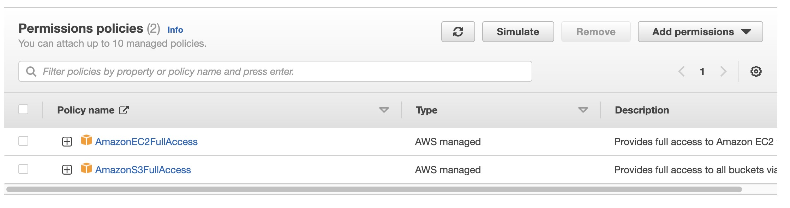

# End-to-End Temperature Forecasting with Apache Airflow Automation

## Project Information

[Apache Airflow](https://airflow.apache.org/) is an open-source platform designed to programmatically author, schedule, and monitor workflows. It allows users to create complex workflows, called DAGs (Directed Acyclic Graphs), which are made up of tasks that can be chained together to form a complete data pipeline. Each task is a unit of work that performs a specific operation, such as extracting data from a source, transforming it, and loading it into a target system. 

Airflow's primary benefit is its ability to manage and automate complex workflows. It provides a user-friendly interface to create and monitor workflows, as well as powerful tools for managing dependencies and executing tasks in parallel. With Airflow, data engineers can easily create and manage pipelines that incorporate data from multiple sources, perform complex transformations, and load the results into target systems. By automating these workflows, Airflow enables data engineers to focus on higher-level tasks, such as designing data models and creating data visualizations, rather than spending time on manual, repetitive tasks.

In this project, I learn about Apache Airflow and use it to automate a weather forecasting project from API data collection up to model deployment and prediction. The project pipeline is as in the diagram below:


The pipeline operates as follows:
1. Data is collected using the [Open-Meteo API](https://github.com/m0rp43us/openmeteopy) which offers free weather forecast APIs. This allows the user to get free two-day historical data in any location. For the purpose of this project, two days will be enough to simulate a real-time environment. 
2. Python scripts are used to perform the data collection, data preprocessing, and model training. 
3. On an AWS EC2 Ubuntu server, apache airflow is deployed and DAGs are created to automate the data collection, preprocessing, model training, and model prediction. 
4. The resulting files from automation are then stored in AWS S3. 

## Business Value

Business using Airflow to automate their data pipelines and processes can derive value by having: 

* Financial savings: By automating the end-to-end data pipeline with Airflow, you can minimize manual effort and reduce labor costs associated with repetitive tasks, resulting in cost savings.
* Time savings: Airflow allows for easy scheduling and automation of data collection, preprocessing, model training, and prediction tasks, saving valuable time for the business and enabling faster decision-making.
* Improved efficiency: With Airflow, you can create complex workflows with dependencies and monitoring, which helps optimize the data pipeline and improve overall operational efficiency.
* Scalability: Airflow is designed to scale horizontally, allowing your business to handle large datasets and increasing the capacity for data processing as your business grows.

## Technical Value

Technical teams can generate value by using Airflow in their workflows by having:

* Workflow automation: Airflow enables the automation of complex data workflows, allowing data scientists and engineers to define, schedule, and orchestrate data pipelines as code. This helps reduce manual effort and human error, improving the overall efficiency and reliability of the data pipeline.
* Modularity and extensibility: Airflow provides a modular and extensible architecture that allows data scientists and engineers to easily integrate with various data sources, data processing libraries, and machine learning frameworks. This makes it highly adaptable to different data engineering and data science use cases, and promotes code reusability and maintainability.
* Flexibility and customization: Airflow provides a flexible and customizable platform that allows data scientists and engineers to tailor the data pipeline to their specific needs. It allows for custom operators, hooks, and sensors to be created, and provides support for plugins, making it highly adaptable to unique data engineering and data science requirements.
* Ease of use and developer-friendly structure: Airflow offers a user-friendly web-based UI for managing workflows, making it easy for data scientists and engineers to monitor and manage their data pipelines. It also provides a Pythonic API and CLI for defining, deploying, and managing workflows as code, making it developer-friendly and accessible to data scientists and engineers with Python programming skills.

## Project Structure

    ├── README.md          <- The top-level documentation for this project.
    ├── data
    │   ├── processed      <- The sample processed data
    │   └── raw            <- The API collected sample data
    ├── ec2_airflow        <- 
    │   ├── dag            <- Folder containing scripts for deploying airflow in ec2
    ├── images             <- The media used in the README documentation
    ├── requirements.sh        <- The requirements file for reproducing the project
    ├── src                <- Folder containing all source code to reproduce the data collection, preprocessing, and model training locally

## Key Project Files

- `data/`: Folder containing sample data gathered from Open-Meteo
    - `raw/`: Folder containing raw gathered data
    - `processed/`: Folder containing for-training data after being preprocessed
- `ec2_airflow`: Folder containing scripts for using airflow in AWS EC2 instance
    - `dag/`
        - `dag.py`: Python file containing airflow script for constructing a four-step DAG from data collection to model prediction
- `src`: Folder containing Python scripts for collecting data, preprocessing data, and training an ML model
    - `get_data.py`: Python file for using Open-Meteo to collect two-day historical weather data
    - `utils.py`: Python file containing all helper functions for data gathering, preprocessing, and model training
    - `preprocess.py`: Python file for performing preprocessing steps such as creating lag columns
    - `train.py`: Python file for training an XGBoost model for forecasting

## Project Instructions

### Setting up

The first step of the project is to use an AWS account to spin up an EC2 server. This [AWS documentation](https://docs.aws.amazon.com/accounts/latest/reference/manage-acct-creating.html) can serve as a guide on creating an account. Note that credit card, debit card, or other payment information will be necessary to create an account so that AWS can process payments for use of their cloud resources. Free tier accounts will suffice for this project but I am going to use a non-free tier EC2 instance to house my airflow server for performance purposes. 

When the AWS Account is active, follow the succeeding steps to launch an EC2 instance:

- Log into the AWS Management Console and search EC2.
- Click the launch instance button and use the following specifications:
    - Ubuntu Server
    - t3.medium instance type
    - Create a security group and click the following options: 
        - Allow HTTPS traffic from the internet option
        - Allow HTTP traffic 
    - Create a new key pair or use an already existing one and save it to your device.

*Notes*

1. The `allow HTTPS and HTTP traffic from anywhere` options are not suggested in production environments. It is better to tailor fit the exact addresses/range of addresses but for the purpose of learning, it should suffice.
2. Ubuntu is not a required option, but it needs to be chosen to follow the commands used in this documentation. 

## Logging into the EC2 Instance

To log in the EC2 instance, click on the instance ID and click `Connect` and go to SSH client which has a copyable command with the format:

```bash
ssh -i <key_pair> <ubuntu@ec2_address>
```

Ensure that the location of the `.pem` file is correct and then paste that command into the terminal. You should be logged in when the terminal changes into something similar to:

```bash
ubuntu@ip-xxx-xx-xx-xx:~$
```

You now have logged into a running EC2 instance. 

## Setting up airflow

Next, you can either clone the repository into the ubuntu server but that will require setting up the proper Git verifications which could take a while. Alternatively, you copy and paste the contents of `requirements.sh` into the ubuntu terminal. This will install all necessary libraries for this project. **One example of a necessary library is the `awscli` as without it, we cannot access the aws services like S3 and EC2 and make them communicate with airflow.** 

Then, check whether airflow is installed by running `airflow` in the terminal.

Once you have confirmed that airflow is installed, create an airflow server with the command:

```python
airflow standalone
```

This will create an airflow server for educational purposes. This is not the recommended server for production and that will require a more in-depth setting up. When the server is set up, access it by copying the EC2 public address into your browser and adding in `:8080` at the end to indicate port 8080 which is where airflow is spun up. 

**You should initially not be able to access it because we need to set up proper routing security credentials first.** To do this, follow these steps:

1. Click the instance ID and click on security.
2. Click the security group of the EC2 instance and click `Edit inbound rules`
3. Add a rule for type `All traffic` and source `Anywhere`. This allows anyone to connect to the EC2 instance. **Again, this is not recommended in production, and only for educational purposes.**

Type in the EC2 public address again at port 8080 and you should see this:


Log into it with the username `admin` and the password being the password generated in the terminal after `airflow standalone`.

Now, we want to make sure that our EC2 instance can communicate with AWS S3 to store all the files we have. To do that, we need to assign IAM roles to our EC2 instance. To do this, follow these steps:

1. Go to your EC2 instance and click on its instance ID
2. Click on Actions --> Security --> Modify IAM roles.
3. Click create new IAM role and click create role.
4. Click on EC2 as the service and add the `AWSEC2FullAccess` and `AWSS3FullAccess` roles as shown below:



5. Attach this role to the EC2 instance. 

Now all that's left is to create an S3 bucket which can easily be done by:

1. Searching for S3 in the AWS console.
2. Creating an S3 bucket with all the default options. Take note of the bucket's name as this will be used to change the DAG scripts. 

## Creating DAG Scripts

To create the scripts, first create a new folder in the Ubuntu server named `dag` and copy and paste the contents of `ec2_airflow` into it. To easily access the remote server, I use [VS Code Extensions for remote access](https://code.visualstudio.com/docs/remote/ssh). Give it a quick read and it'll greatly improve your workflow. 

The VScode extension will look something like this once connected: 


Then, continue with creating a new folder in the Ubuntu server named `dag` and copy and paste the contents of `ec2_airflow` into it. Next, click on the airflow folder and go to `airflow.cfg` and change the `dags_folder = /home/ubuntu/airflow/dags` into `dags_folder = /home/ubuntu/dag` where we placed our airflow scripts. This lets airflow know that the scripts are located in that directory. 

**Don't forget to change the bucket_name in `dag.py` to the bucket name you put when creating the S3 bucket**

Once done, restart the airflow server, by clicking `Ctrl + C` in the ubuntu terminal and running `airflow standalone` again. 

You should now see that the airflow UI has an additional dag named `ml_pipeline`


Unpause the pipeline, and click on it and look at the graph which should contain a four-step DAG as shown below:


Then, the final step is to click on the run button at the top right and `Trigger DAG`. When the steps are followed correctly, all four steps should turned dark green indicating a success! 

To check whether the process was successful, go to your AWS S3 bucket and four files should be created as shown below:


* `airflow_train.csv`: file generated by automated data collection using Open-Meteo
* `processed_airflow_train.csv`: file generated after preprocessing the collected data
* `model.pkl`: pickle file generated after training an XGBoost model with the processed data
* `predictions.json`: file containing forecast of temperatures 

## Conclusions

Overall, from this project, I am able to make the following conclusions:

* Apache Airflow has proven to be a powerful tool for automating complex data pipelines, from data collection to preprocessing to machine learning model training and prediction. By leveraging Airflow's DAG (Directed Acyclic Graph) concept, I was able to create a streamlined and automated data pipeline that can save time and effort in data engineering and data science tasks.
* By using AWS EC2, specifically an Ubuntu server to host the Airflow UI, I was able to take advantage of the scalability and flexibility of cloud computing. AWS EC2 allows us to easily provision virtual machines in the cloud, providing ample resources for running your Airflow instance, and enabling one to scale your pipeline as needed to accommodate varying workloads.
* Utilizing AWS S3 as the storage destination for your pipeline results provides a cost-effective and scalable solution for storing and retrieving large amounts of data. S3's durability, availability, and scalability make it an ideal choice for saving your processed data and model results, while also allowing for easy integration with other AWS services or external applications.
* Building and deploying a data pipeline using Apache Airflow and AWS EC2/S3 can provide valuable learning opportunities in the areas of data engineering, data science, and cloud computing. By working with these tools, one can gain hands-on experience in designing, implementing, and managing data pipelines in a real-world scenario, and enhance your skills in these critical areas of modern data-driven applications.

## Recommendations

Based on this project using Apache Airflow to automate a data pipeline with an AWS EC2 Ubuntu server and AWS S3, here are some of my recommendations for future improvements:

1. Implement data monitoring and alerting: Set up data monitoring and alerting mechanisms to detect anomalies, errors, or other issues in the data pipeline. This could involve using Airflow's built-in monitoring features, integrating with AWS CloudWatch for monitoring EC2 instance performance, or using third-party tools for log analysis and alerting. Monitoring and alerting can help ensure data pipeline reliability and identify and resolve issues in a timely manner.
2. Enhance data processing and model training: Explore options to further enhance data preprocessing and model training steps in the data pipeline. This could include implementing advanced data processing techniques, incorporating feature engineering, or experimenting with different machine learning algorithms to improve model accuracy and performance.
3. Explore additional AWS services: Consider exploring other AWS services that can complement or enhance your data pipeline. For example, one could leverage Amazon Redshift for data warehousing and analytics, Amazon RDS for managed relational databases, AWS Lambda for serverless computing, or Amazon SageMaker for machine learning model hosting and training.

## References

- Checkout this great tutorial by Darshil Parmar: https://www.youtube.com/watch?v=q8q3OFFfY6c
    - This video is what inspired me to try out airflow.
- https://github.com/apache/airflow-client-python/blob/main/airflow_client/README.md
- https://docs.aws.amazon.com/ec2/index.html
- https://docs.aws.amazon.com/s3/index.html
- https://docs.aws.amazon.com/IAM/latest/UserGuide/id_roles.html
- https://stackoverflow.com/ (A lot of this!)
